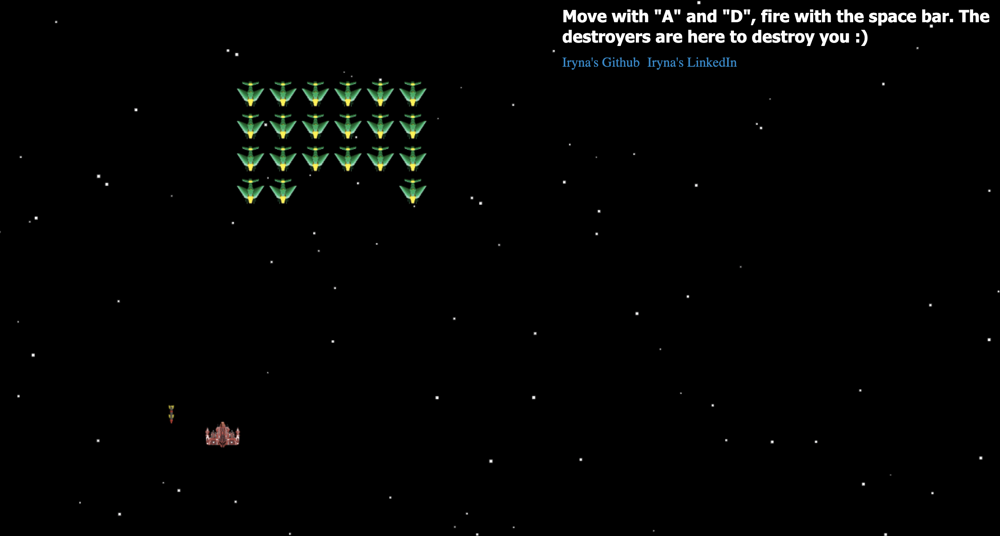

# Space Destroyers (Space Invaders)

This game is written in plain Javascript (ES5 syntax) as one of my App Academy projects.

No jQuery or any other third party libraries, just plain JavaScript, CSS and HTML.

See it live: https://irynamcb.github.io/SpaceDestroyers

## Intro

The aliens are coming to destroy our planet! Your job is to stop them. 

Press "K" to start a game. 
Move left and right with "A" and "D". 
Fire with a spacebar.

When you kill an alien, there is an explosion! 

## Future features

I am planning to implement different levels of complexity.
Add different movements for the aliens.
Add animation for the alien ships.
